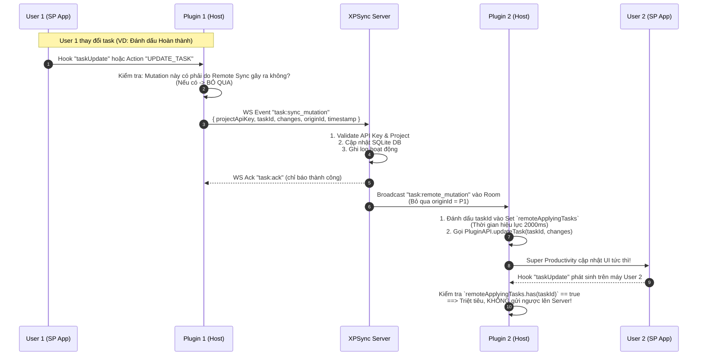

# Implementation Plan: XPSync - Realtime Task Sync for Super Productivity

> **Trạng thái triển khai (27/09/2026):** Đã dựng server, dashboard, plugin, build ZIP và bộ kiểm thử tự động. Chi tiết vận hành trong `README.md`, giao thức và các điều chỉnh theo API thực tế trong `docs/protocol.md`. Bước cài ZIP/smoke test trực tiếp trên hai bản Super Productivity còn cần thực hiện trong môi trường ứng dụng thật.

## 1. Goal Description
Xây dựng giải pháp đồng bộ thời gian thực (Realtime Task Sync) cho ứng dụng **Super Productivity (SP)** giữa nhiều người dùng trong cùng một nhóm/dự án, bao gồm:
1. **Super Productivity Plugin (`xpsync-plugin`)**:
   - Giao diện cài đặt (Iframe UI): Nhập địa chỉ Server (IP/Domain), tên người dùng (Username), cấu hình ghép nối (Mapping) giữa Project cục bộ trên Super Productivity với Project trên Server thông qua **API Key**.
   - Background Script (`plugin.js`): Kết nối WebSocket đến Server, lắng nghe sự kiện thay đổi Task trong Super Productivity thông qua Plugin Hooks/Redux Actions, đồng thời nhận cập nhật từ người dùng khác qua WebSocket để cập nhật trực tiếp vào Super Productivity theo thời gian thực (Realtime).
   - Cơ chế triệt tiêu vòng lặp đồng bộ vô hạn (Echo Suppression Loop Prevention).
2. **Sync Server & Admin Dashboard (`xpsync-server`)**:
   - Backend quản trị & Realtime Gateway (Node.js/TypeScript + WebSockets/Socket.IO + SQLite/Drizzle ORM).
   - Trang quản trị Admin (Web UI): Đăng nhập Admin, tạo và quản lý Project, sinh API Key riêng cho từng Project, xem danh sách và trạng thái các Task được sync theo thời gian thực, xem các thành viên đang online trong từng Project.

---

## 2. Tài liệu tham khảo chính thức của Super Productivity
> [!IMPORTANT]
> **Tài liệu hướng dẫn phát triển Plugin của Super Productivity:**  
> [Super Productivity Plugin Development Guide](https://github.com/super-productivity/super-productivity/blob/master/docs/plugin-development.md)
> 
> *Các cơ chế cốt lõi được áp dụng từ tài liệu trên:*
> - Cấu trúc plugin: `manifest.json`, `plugin.js` (Host renderer context), `index.html` (Iframe UI hỗ trợ tự động inject Theme CSS variables và UI Kit).
> - Permissions: `getTasks`, `addTask`, `updateTask`, `deleteTask`, `getAllProjects`, `addProject`, `updateProject`.
> - Hooks: `taskComplete`, `taskUpdate`, `taskDelete`, `action` (NgRx Redux actions interceptor).
> - Secret Storage: `PluginAPI.setSecret()`, `PluginAPI.getSecret()` bảo vệ Project API Keys.
> - Data Persistence: `PluginAPI.persistDataSynced()` / `PluginAPI.loadSyncedData()` cho cấu hình kết nối.
> - Đóng gói dạng file `.zip` để cài đặt thông qua **Settings > Plugins > Choose Plugin File**.

---

## 3. Kiến trúc tổng thể hệ thống (System Architecture)

### 3.1. Sơ đồ kiến trúc (Architecture Diagram)

```mermaid
flowchart TB
    subgraph ClientA["Super Productivity (User A)"]
        UI_A["Plugin UI (index.html)<br/>Settings & Status"]
        Host_A["Plugin Background (plugin.js)<br/>Hook Listeners & WS Client"]
        SP_Store_A["Super Productivity Store<br/>(Tasks, Projects)"]
        
        UI_A <-->|PluginAPI / PostMessage| Host_A
        Host_A <-->|PluginAPI: hooks / getTasks / updateTask| SP_Store_A
    end

    subgraph ClientB["Super Productivity (User B)"]
        UI_B["Plugin UI (index.html)<br/>Settings & Status"]
        Host_B["Plugin Background (plugin.js)<br/>Hook Listeners & WS Client"]
        SP_Store_B["Super Productivity Store<br/>(Tasks, Projects)"]
        
        UI_B <-->|PluginAPI / PostMessage| Host_B
        Host_B <-->|PluginAPI: hooks / getTasks / updateTask| SP_Store_B
    end

    subgraph Server["XPSync Server (Node.js + WebSockets)"]
        AuthModule["Admin Auth & JWT"]
        ProjModule["Project & API Key Manager"]
        TaskModule["Task Store (SQLite Database)"]
        WSHub["Realtime WebSocket Hub<br/>(Rooms by Project API Key)"]
        AdminUI["Admin Web Dashboard<br/>(Task Monitor & Online Users)"]
        
        AdminUI <-->|REST API| ProjModule
        AdminUI <-->|REST API| TaskModule
        AuthModule --> ProjModule
        WSHub <--> TaskModule
    end

    Host_A <==>|WebSocket: ws://server:3001<br/>Join Room (API Key + User)| WSHub
    Host_B <==>|WebSocket: ws://server:3001<br/>Join Room (API Key + User)| WSHub
```

---

### 3.2. Luồng đồng bộ thời gian thực & Chống lặp (Sync Flow & Echo Loop Prevention)

Vấn đề sống còn của việc sync hai chiều giữa Super Productivity và Server là **Infinite Echo Loop** (User A sửa task $\to$ bắn lên Server $\to$ Server bắn về User B $\to$ User B update vào SP $\to$ Hook của SP trên User B bắt được sự kiện và lại bắn lên Server...).



---

## 4. User Review Required

> [!IMPORTANT]
> **Các quyết định kỹ thuật cần người dùng xác nhận:**
> 1. **Phạm vi dữ liệu Task cần đồng bộ:**
>    - Super Productivity hỗ trợ nhiều trường dữ liệu: `title`, `isDone`, `timeSpent`, `timeEstimate`, `notes`, `subTasks`, `tags`.
>    - Kế hoạch đề xuất: Đồng bộ các trường chính (`title`, `isDone`, `notes`, `timeSpent`, `timeEstimate`, `subTasks`). Các trường đặc thù cục bộ của từng máy (như reminder âm thanh cá nhân) sẽ giữ độc lập để không làm xáo trộn trải nghiệm cá nhân của thành viên khác.
> 2. **Xử lý xung đột khi 2 người sửa cùng 1 Task cùng lúc:**
>    - Áp dụng chiến lược **LWW (Last-Write-Wins) dựa trên Timestamp** kèm **Field-Level Patch** (nếu User A sửa title và User B tích hoàn thành cùng lúc, cả 2 thay đổi đều được giữ nguyên thay vì ghi đè toàn bộ đối tượng task).
> 3. **Công nghệ Server:**
>    - Đề xuất: **Node.js (Express + Socket.IO + Better-SQLite3 / Drizzle)**.
>    - Lý do: Nhẹ, tốc độ cao, file DB SQLite đơn lẻ không cần cài thêm PostgreSQL/MySQL rườm rà, rất dễ chạy trên VPS hoặc máy bàn nội bộ (LAN).

---

## 5. Chi tiết các thành phần (Proposed Components)

### 5.1. Cấu trúc thư mục dự án (`XPSync`)

```
XPSync/
├── server/                     # Backend + Admin Dashboard
│   ├── src/
│   │   ├── config/             # Cấu hình PORT, JWT_SECRET, DB path
│   │   ├── db/                 # SQLite Database & Schemas (Drizzle/Better-sqlite3)
│   │   ├── middleware/         # Auth JWT middleware, API Key validator
│   │   ├── routes/             # REST API: auth, projects, tasks, stats
│   │   ├── websocket/          # WebSocket / Socket.IO Hub & Room handlers
│   │   └── server.ts           # Entry point
│   ├── public/                 # Static Admin Dashboard (Single Page App - HTML5/CSS/JS)
│   │   ├── index.html          # Admin UI (Login, Projects list, Key Generator, Task Viewer)
│   │   ├── admin.css           # Styling
│   │   └── admin.js            # Admin App Logic
│   ├── package.json
│   └── tsconfig.json
│
├── plugin/                     # Super Productivity Plugin
│   ├── manifest.json           # Plugin Manifest chuẩn Super Productivity
│   ├── plugin.js               # Host-side logic: Hooks, WebSocket client, echo suppression
│   ├── index.html              # Settings & Dashboard Iframe UI
│   ├── icon.svg                # Plugin icon
│   └── build.js                # Script zip plugin thành xpsync.zip sẵn sàng import
│
└── README.md                   # Hướng dẫn cài đặt và sử dụng
```

---

### 5.2. Component 1: XPSync Server & Admin Dashboard

#### A. Database Schema (SQLite)
- **`admins`**: `id`, `username`, `password_hash`, `created_at`.
- **`projects`**: `id`, `name`, `api_key` (Unique, vd: `xps_prj_9f8a7c...`), `description`, `created_at`, `updated_at`.
- **`tasks`**:
  - `id`: Khóa chính (trùng với Task ID trên Super Productivity).
  - `project_id`: ID project trên Server.
  - `title`: Tên công việc.
  - `is_done`: Trạng thái hoàn thành (boolean).
  - `notes`: Ghi chú.
  - `time_spent`: Thời gian đã làm (ms).
  - `time_estimate`: Thời gian ước tính (ms).
  - `last_updated_by`: Tên user cuối cùng cập nhật.
  - `updated_at`: Timestamp cập nhật cuối.
  - `raw_data`: JSON lưu trữ đầy đủ thuộc tính khác (subtasks, tags...).
- **`activity_logs`**: `id`, `project_id`, `user_name`, `action` (CREATE, UPDATE, DELETE), `task_title`, `timestamp`.

#### B. API Endpoints
- **Auth**:
  - `POST /api/auth/login`: Đăng nhập admin $\to$ trả về JWT Token.
  - `POST /api/auth/setup`: Tạo tài khoản admin lần đầu nếu chưa có.
- **Projects (Admin Only - yêu cầu JWT)**:
  - `GET /api/projects`: Danh sách các project kèm số lượng task và số user online.
  - `POST /api/projects`: Tạo project mới $\to$ Tự động sinh `api_key` ngẫu nhiên bảo mật.
  - `POST /api/projects/:id/regenerate-key`: Đổi API key mới cho project.
  - `DELETE /api/projects/:id`: Xóa project và toàn bộ tasks liên quan.
- **Tasks & Monitor (Admin Only)**:
  - `GET /api/projects/:id/tasks`: Xem toàn bộ tasks trong project.
  - `GET /api/projects/:id/logs`: Xem lịch sử chỉnh sửa task gần nhất.
- **Public / Client Verification**:
  - `POST /api/client/verify`: Client kiểm tra kết nối Server và tính hợp lệ của API Key.

#### C. Realtime WebSocket Gateway
- Sử dụng Socket.IO hoặc `ws`:
  - **Handshake / Join Room**: Client gửi `{ projectApiKey, username, clientVersion }`.
    - Server xác thực `projectApiKey`. Nếu hợp lệ $\to$ Cho client tham gia `room:project_<id>`.
    - Broadcast cho room: `{ type: "presence:join", username }`.
    - Trả về danh sách Task hiện tại của Project trên Server để client đối soát lần đầu (Initial Sync).
  - **Task Event Handlers**:
    - `task:push_mutation`: Client gửi thay đổi. Server lưu vào DB, broadcast tới các client khác trong room.
    - `task:full_sync`: Hỗ trợ sync toàn bộ danh sách khi khởi động hoặc reconnect.
    - `disconnect`: Server tự động rời room và thông báo cho các user khác.

#### D. Admin Dashboard Web UI (`public/index.html`)
- Giao diện trực quan, responsive:
  1. **Tab Đăng nhập / Xác thực**: Bảo mật bằng JWT, tự động lưu token vào localStorage.
  2. **Tab Quản lý Projects**:
     - Nút "Tạo Project mới" $\to$ Modal nhập tên, sinh ra ngay API Key dạng chuỗi có thể copy 1-click.
     - Danh sách Project: Hiển thị Tên, API Key (ẩn/hiện), Ngày tạo, Số lượng Task, Huy hiệu báo số user đang kết nối (Live).
  3. **Tab Quản lý Tasks (Task Inspector)**:
     - Chọn project để xem chi tiết danh sách Task.
     - Lọc theo: Tất cả, Đang làm, Đã hoàn thành.
     - Xem thời gian cập nhật và ai là người chỉnh sửa gần nhất.
     - Xem Activity Log trực tiếp (Live Stream log hoạt động).

---

### 5.3. Component 2: Super Productivity Plugin (`xpsync-plugin`)

Theo [Super Productivity Plugin Development Guide](https://github.com/super-productivity/super-productivity/blob/master/docs/plugin-development.md):

#### A. `manifest.json`
```json
{
  "id": "xpsync-realtime",
  "name": "XPSync Realtime Tasks",
  "version": "1.0.0",
  "description": "Realtime task synchronization for team projects in Super Productivity",
  "manifestVersion": 1,
  "minSupVersion": "14.0.0",
  "icon": "icon.svg",
  "iFrame": true,
  "sidePanel": false,
  "permissions": [
    "getTasks",
    "addTask",
    "updateTask",
    "deleteTask",
    "getAllProjects",
    "addProject",
    "updateProject"
  ],
  "hooks": [
    "taskComplete",
    "taskUpdate",
    "taskDelete",
    "action"
  ]
}
```

#### B. `plugin.js` (Host Background Script)
- **Quản lý cấu hình**:
  - Đọc Server URL, Username, Project Mappings từ `PluginAPI.loadSyncedData()` hoặc `localStorage`.
  - Đọc API Keys bí mật từ `PluginAPI.getSecret(projectId)`.
- **Kết nối WebSocket**:
  - Mở kết nối WebSocket tới Server `ws://<server_ip>:<port>`.
  - Tự động kết nối lại khi rớt mạng (Auto-reconnect với Exponential Backoff).
  - Gửi thông điệp `join` tương ứng với các Project đã được cấu hình API Key.
- **Lắng nghe sự kiện từ Super Productivity**:
  - Dùng `PluginAPI.registerHook(PluginAPI.Hooks.ACTION, (action) => ...)`:
    - Bắt các action: `[Task] Add Task`, `[Task] Update Task`, `[Task] Delete Task`.
    - Kiểm tra xem task thuộc Project nào (thông qua `projectId` của Task).
    - Nếu Project này nằm trong danh sách Project có gắn API Key đồng bộ:
      - Kiểm tra Task ID có trong `remoteApplyingTaskIds` không. Nếu có $\to$ Bỏ qua.
      - Nếu là thao tác người dùng tại chỗ $\to$ Đóng gói payload gửi lên Server qua WebSocket.
- **Nhận sự kiện từ Server**:
  - Nhận event `task:remote_mutation`:
    - Đưa `taskId` vào `remoteApplyingTaskIds` với TTL 2 giây.
    - Tìm task trong Super Productivity bằng `PluginAPI.getTasks()`.
    - Nếu task đã có $\to$ gọi `PluginAPI.updateTask(taskId, updates)`.
    - Nếu task chưa có $\to$ gọi `PluginAPI.addTask({ ...data, projectId: localProjectId })`.
    - Hiển thị thông báo nhỏ qua `PluginAPI.showSnack({ msg: `Task "${task.title}" vừa được cập nhật bởi ${user}`, type: 'INFO' })`.
- **Giao diện cấu hình**:
  - Đăng ký nút trên Header: `PluginAPI.registerHeaderButton(...)` để mở nhanh cửa sổ cấu hình `index.html`.

#### C. `index.html` (Plugin Settings UI)
- Tận dụng tự động CSS Theme Variables (`var(--c-primary)`, `var(--card-bg)`, `var(--text-color)`) và UI Kit của Super Productivity.
- **Form cấu hình**:
  1. **Server Settings**:
     - Ô nhập Server URL / IP (Ví dụ: `http://192.168.1.100:3001`).
     - Ô nhập Username (Ví dụ: `JulyLun`).
     - Nút "Kiểm tra kết nối" (Ping Server).
  2. **Project Mapping Section**:
     - Đọc danh sách Project cục bộ trên SP thông qua `PluginAPI.getAllProjects()`.
     - Cho phép người dùng bấm "Thêm mapping dự án":
       - Chọn Project cục bộ từ Dropdown (hoặc nhập tên Project).
       - Nhập API Key của Project do Admin cấp trên Server.
       - Trạng thái kết nối: `🟢 Đã kết nối` / `🔴 Chưa kết nối` / `⚠️ Sai API Key`.
  3. **Nút "Sync ngay bây giờ" (Force Full Sync)**:
     - Gửi yêu cầu pull toàn bộ task mới nhất từ Server về máy.
  4. **Live Activity Box**:
     - Hiển thị ngắn 5 cập nhật mới nhất vừa được đồng bộ.

---

## 6. Kế hoạch triển khai chi tiết từng bước (Step-by-Step Implementation)

### Giai đoạn 1: Xây dựng XPSync Server & Admin Dashboard
1. Khởi tạo project `server/` với TypeScript, Express, Socket.IO, Better-SQLite3.
2. Thiết kế database schema và các helper DB query (Projects, Tasks, Users, ActivityLogs).
3. Viết REST API cho Admin (Đăng nhập, Quản lý Project, Sinh API Key, Xem danh sách Task).
4. Viết Realtime WebSocket Gateway xử lý kết nối, phân phòng theo API Key, định tuyến sự kiện task.
5. Thiết kế giao diện Admin Dashboard đơn giản, đẹp mắt tại `server/public/` (Login + Projects + Tasks monitor).

### Giai đoạn 2: Xây dựng Super Productivity Plugin
1. Tạo cấu trúc thư mục `plugin/` gồm `manifest.json`, `icon.svg`.
2. Thiết kế giao diện cấu hình `index.html` theo chuẩn UI Kit của Super Productivity:
   - Form nhập Server IP, Username.
   - Bảng ánh xạ Local Project $\leftrightarrow$ Server API Key.
   - Trạng thái kết nối Realtime.
3. Lập trình `plugin.js`:
   - Xử lý lưu/đọc config từ `PluginAPI.persistDataSynced` / `setSecret`.
   - Kết nối WebSocket tới Server.
   - Đăng ký Header button mở settings.
   - Bắt hook NgRx actions của Super Productivity.
   - Lập trình cơ chế Echo Suppression (Set lưu trữ `remoteApplyingTaskIds` chống vòng lặp).
   - Áp dụng các thay đổi từ xa vào Super Productivity thông qua `PluginAPI.addTask` và `PluginAPI.updateTask`.
4. Viết script `build.js` tự động nén thành file `xpsync.zip`.

### Giai đoạn 3: Kiểm thử & Tối ưu hóa (Verification & Hardening)
1. Kiểm thử kết nối Server và tính hợp lệ của API Key.
2. Kiểm thử tạo Task mới trên Super Productivity $\to$ Kiểm tra Server nhận được và hiển thị trong Admin Dashboard.
3. Kiểm thử Realtime Sync 2 chiều giữa 2 phiên bản Super Productivity (hoặc 1 client SP + 1 script mô phỏng client thứ 2).
4. Kiểm thử trường hợp ngắt mạng rồi kết nối lại (Offline to Online sync).
5. Viết tài liệu hướng dẫn sử dụng và triển khai chi tiết (`README.md`).

---

## 7. Verification Plan

### A. Automated / Script Tests
- **API Tests (`server/tests`)**:
  - Test đăng nhập admin và sinh API Key.
  - Test WebSocket handshake với API Key đúng và sai.
  - Test logic cập nhật task và lưu vào SQLite.
- Lệnh chạy: `npm test` trong thư mục `server/`.

### B. Manual Verification
1. **Kiểm tra Server & Admin UI**:
   - Chạy `npm run dev` trong `server/`.
   - Mở trình duyệt vào `http://localhost:3001/admin`.
   - Đăng nhập tài khoản admin mặc định.
   - Tạo Project mới tên "Project Team Alpha" $\to$ Sao chép API Key vừa được sinh.
2. **Kiểm tra Plugin Super Productivity**:
   - Chạy `node build.js` trong thư mục `plugin/` để tạo `xpsync.zip`.
   - Mở Super Productivity $\to$ **Settings** $\to$ **Plugins** $\to$ **Choose Plugin File** $\to$ Chọn file `xpsync.zip`.
   - Bấm vào icon plugin trên Header $\to$ Nhập Server URL `http://localhost:3001`, Username `Alice`.
   - Chọn Project trên SP (hoặc tạo project mới) $\to$ Dán API Key của "Project Team Alpha".
   - Bấm "Lưu & Kết nối" $\to$ Kiểm tra trạng thái báo xanh "🟢 Đã kết nối".
3. **Kiểm tra Đồng bộ 2 chiều (Realtime Sync)**:
   - Tạo 1 task mới trên Super Productivity: "Thiết kế database".
   - Mở Admin Dashboard trên Server $\to$ Thấy task "Thiết kế database" xuất hiện ngay lập tức.
   - Đổi trạng thái hoặc sửa tên task $\to$ Kiểm tra log và socket event phản hồi chính xác không bị lặp vòng lặp (No echo loop).
